# Design Document

## Overview

The agentic AI-powered test automation platform is designed as an enterprise-grade, cloud-native system that uses **AWS Bedrock exclusively** for all AI/GenAI capabilities. **No external GenAI services (OpenAI, Anthropic direct, Google, EPAM AI DIAL, or any other third-party AI services) are used.** The platform leverages AWS Bedrock foundation models (Claude 3 family and Amazon Titan) through an intelligent model router, implements autonomous AI agents for different testing domains, and provides extensible architecture for specialized testing needs.

The system follows a cloud-native AWS architecture with all AI processing through AWS Bedrock. This approach provides enterprise-ready features (IAM-based authentication, VPC security, CloudWatch monitoring, audit logging) while maintaining specialized testing capabilities (Playwright execution, element detection, visual testing, performance analysis).

The platform consists of three main layers: AWS Bedrock Integration Layer (model routing, conversation management), Agentic AI Testing Layer (six specialized agents powered by Bedrock), and Enhanced Test Automation Engine (Playwright execution, element detection, reporting).

## Architecture

The platform follows a three-layer architecture integrating AI DIAL with specialized testing capabilities:

```mermaid
graph TB
    subgraph "Frontend Layer"
        CHAT[Conversational Chat UI]
        WEB[Test Management UI]
        API_GW[API Gateway]
    end
    
    subgraph "AWS Bedrock Integration Layer"
        BEDROCK_CORE[Bedrock Service Layer]
        MODEL_ROUTER[Bedrock Model Router]
        
        subgraph "AWS Bedrock Models ONLY"
            CLAUDE_OPUS[Claude 3 Opus via Bedrock]
            CLAUDE_SONNET[Claude 3 Sonnet via Bedrock]
            CLAUDE_HAIKU[Claude 3 Haiku via Bedrock]
            TITAN_TEXT[Amazon Titan Text]
            TITAN_EMBED[Amazon Titan Embeddings]
        end
        
        subgraph "Testing Capabilities"
            VISUAL_CAP[Visual Testing]
            API_CAP[API Testing]
            PERF_CAP[Performance Testing]
            DATA_CAP[Test Data Generation]
        end
    end
    
    subgraph "Agentic AI Testing Layer"
        TEST_GEN_AGENT[Test Generator Agent]
        TEST_EXEC_AGENT[Test Executor Agent]
        TEST_HEAL_AGENT[Test Healer Agent]
        ANALYTICS_AGENT[Analytics Agent]
        ORCHESTRATOR[Orchestrator Agent]
        LEARNING_AGENT[Learning Agent]
    end
    
    subgraph "Enhanced Test Automation Engine"
        PLAYWRIGHT[Playwright Execution]
        ELEMENT_DETECT[Element Detection]
        REPORT_SVC[Reporting Service]
        VISUAL_TEST[Visual Testing]
    end
    
    subgraph "AWS Infrastructure Layer"
        QUEUE[SQS Message Queue]
        DB[(DynamoDB)]
        STORAGE[(S3 Storage)]
        BROWSER_GRID[Browser Grid]
        METRICS[(CloudWatch Metrics)]
    end
    
    CHAT --> API_GW
    WEB --> API_GW
    API_GW --> BEDROCK_CORE
    
    BEDROCK_CORE --> MODEL_ROUTER
    MODEL_ROUTER --> CLAUDE_OPUS
    MODEL_ROUTER --> CLAUDE_SONNET
    MODEL_ROUTER --> CLAUDE_HAIKU
    MODEL_ROUTER --> TITAN_TEXT
    MODEL_ROUTER --> TITAN_EMBED
    
    BEDROCK_CORE --> VISUAL_CAP
    BEDROCK_CORE --> API_CAP
    BEDROCK_CORE --> PERF_CAP
    BEDROCK_CORE --> DATA_CAP
    
    BEDROCK_CORE --> ORCHESTRATOR
    ORCHESTRATOR --> TEST_GEN_AGENT
    ORCHESTRATOR --> TEST_EXEC_AGENT
    ORCHESTRATOR --> TEST_HEAL_AGENT
    ORCHESTRATOR --> ANALYTICS_AGENT
    ORCHESTRATOR --> LEARNING_AGENT
    
    TEST_GEN_AGENT --> PLAYWRIGHT
    TEST_EXEC_AGENT --> PLAYWRIGHT
    TEST_HEAL_AGENT --> ELEMENT_DETECT
    ANALYTICS_AGENT --> REPORT_SVC
    
    VISUAL_CAP --> VISUAL_TEST
    API_CAP --> PLAYWRIGHT
    PERF_CAP --> BROWSER_GRID
    DATA_CAP --> DB
    
    PLAYWRIGHT --> BROWSER_GRID
    ELEMENT_DETECT --> VISUAL_TEST
    REPORT_SVC --> STORAGE
    
    ORCHESTRATOR --> QUEUE
    QUEUE --> DB
    REPORT_SVC --> METRICS
```



### Layer Architecture

#### Frontend Layer
- **Conversational Chat UI**: Natural language interface for test creation powered by AWS Bedrock
- **Test Management UI**: Traditional UI for test organization, execution, and reporting
- **API Gateway**: AWS API Gateway for authentication, rate limiting, and request routing

#### AWS Bedrock Integration Layer
- **Bedrock Service Layer**: Central orchestration for all AI/GenAI operations using AWS Bedrock exclusively
- **Bedrock Model Router**: Intelligent routing between Claude 3 models (Opus, Sonnet, Haiku) and Amazon Titan based on task requirements
- **AWS Bedrock Models ONLY**: Claude 3 Opus, Claude 3 Sonnet, Claude 3 Haiku, Amazon Titan Text, Amazon Titan Embeddings
- **Testing Capabilities**: Specialized testing features powered by Bedrock (visual, API, performance, test data)
- **NO External GenAI**: Explicitly no OpenAI, Anthropic direct, Google, AI DIAL, or any external AI services

#### Agentic AI Testing Layer (Powered by AWS Bedrock)
- **Test Generator Agent**: Converts natural language to executable tests using Claude 3 models
- **Test Executor Agent**: Schedules and optimizes test execution with Bedrock-powered intelligence
- **Test Healer Agent**: Automatically repairs broken tests using Claude 3 for analysis
- **Analytics Agent**: Analyzes test results and predicts failures using Bedrock models
- **Orchestrator Agent**: Coordinates agent communication using Bedrock for decision-making
- **Learning Agent**: Learns from execution history using Bedrock models for pattern recognition

#### Enhanced Test Automation Engine
- **Playwright Execution**: Cross-browser test execution with parallel capabilities
- **Element Detection**: Intelligent element location with Bedrock-powered self-healing
- **Reporting Service**: Comprehensive test reports with Bedrock-powered analytics
- **Visual Testing**: Computer vision-based validation using Claude 3 for visual understanding

#### AWS Infrastructure Layer
- **SQS Message Queue**: Asynchronous processing and agent communication
- **DynamoDB**: Scalable NoSQL database for test definitions, results, and analytics
- **S3 Storage**: Object storage for test artifacts (screenshots, videos, logs, reports)
- **Browser Grid**: Scalable browser instances for parallel test execution
- **CloudWatch Metrics**: AWS native monitoring and metrics collection

## Components and Interfaces

### 1. AWS Bedrock Integration Service

**Purpose**: Provides conversational AI capabilities exclusively through AWS Bedrock with intelligent model routing.

**Key Interfaces**:
```typescript
interface BedrockService {
  createConversation(config: ConversationConfig): Promise<Conversation>
  sendMessage(conversationId: string, message: string): Promise<AIResponse>
  routeToBedrockModel(task: Task): Promise<ModelSelection>
  invokeModel(modelId: string, prompt: string, config: ModelConfig): Promise<ModelResponse>
  invokeModelWithResponseStream(modelId: string, prompt: string): AsyncIterable<ModelResponse>
}

interface ConversationConfig {
  userId: string
  bedrockModelId: string  // Only AWS Bedrock model IDs allowed
  systemPrompt: string
  context: ConversationContext
  temperature: number
  maxTokens: number
}

interface ModelSelection {
  primaryModel: BedrockModelId  // Only Bedrock models
  fallbackModels: BedrockModelId[]  // Only Bedrock models
  reasoning: string
  estimatedCost: number
}

type BedrockModelId = 
  | 'anthropic.claude-3-opus-20240229-v1:0'
  | 'anthropic.claude-3-sonnet-20240229-v1:0'
  | 'anthropic.claude-3-haiku-20240307-v1:0'
  | 'amazon.titan-text-express-v1'
  | 'amazon.titan-embed-text-v1'
```

**Implementation**: Uses AWS Bedrock SDK exclusively. Supports Claude 3 Opus for complex reasoning, Claude 3 Sonnet for balanced performance, Claude 3 Haiku for fast responses, and Amazon Titan for cost-effective operations. **No external AI services are used.**

### 2. Agentic AI Framework

**Purpose**: Provides autonomous AI agents specialized for different testing domains.

**Base Agent Interface**:
```typescript
abstract class BaseAgent {
  id: string
  type: AgentType
  capabilities: AgentCapability[]
  status: AgentStatus
  
  abstract execute(task: Task): Promise<TaskResult>
  abstract communicate(message: AgentMessage): Promise<AgentResponse>
  abstract learn(feedback: Feedback): Promise<void>
  
  protected async callBedrock(prompt: string, modelId?: BedrockModelId): Promise<AIResponse>
  protected async coordinateWithAgent(agentId: string, message: AgentMessage): Promise<AgentResponse>
  protected async updateKnowledgeBase(knowledge: Knowledge): Promise<void>
}

interface AgentMessage {
  from: string
  to: string
  type: MessageType
  payload: any
  context: ExecutionContext
  priority: Priority
}

interface TaskResult {
  success: boolean
  data: any
  confidence: number
  reasoning: string
  nextActions: Action[]
}
```

#### 2.1 Test Generator Agent

**Purpose**: Converts natural language requirements into executable test cases.

**Capabilities**:
- Natural language understanding for test requirements
- Test step generation with proper assertions
- Page object model creation from UI analysis
- Test data generation based on schema
- Edge case identification

**Implementation**:
```typescript
class TestGeneratorAgent extends BaseAgent {
  async execute(task: GenerateTestTask): Promise<TestDefinition> {
    // Use AWS Bedrock Claude 3 Opus for complex test generation
    const conversation = await this.bedrockService.createConversation({
      bedrockModelId: 'anthropic.claude-3-opus-20240229-v1:0',
      systemPrompt: this.getSystemPrompt(),
      context: task.context
    })
    
    // Iterative test generation using Bedrock
    const testSteps = await this.generateSteps(conversation, task.description)
    const pageObjects = await this.generatePageObjects(testSteps)
    const testData = await this.generateTestData(testSteps)
    
    // Validate and enhance
    const validatedTest = await this.validateTest(testSteps)
    const enhancedTest = await this.enhanceWithSelectors(validatedTest)
    
    return this.buildTestDefinition(enhancedTest, pageObjects, testData)
  }
  
  private getSystemPrompt(): string {
    return `You are an expert test automation engineer powered by AWS Bedrock specializing in:
    - Converting natural language to executable test steps
    - Identifying UI elements and suggesting robust selectors
    - Generating comprehensive test scenarios including edge cases
    - Creating maintainable page object models
    - Following testing best practices and patterns
    
    Always ask clarifying questions for ambiguous requirements.
    Consider accessibility, performance, and security in test design.
    
    Note: All AI processing is done exclusively through AWS Bedrock for security and compliance.`
  }
}
```

#### 2.2 Test Executor Agent

**Purpose**: Intelligently schedules and optimizes test execution across environments.

**Capabilities**:
- Dynamic test prioritization based on risk and change impact
- Parallel execution optimization
- Resource allocation and load balancing
- Intelligent retry strategies for flaky tests
- Real-time execution monitoring

**Implementation**:
```typescript
class TestExecutorAgent extends BaseAgent {
  async execute(task: ExecuteTestTask): Promise<ExecutionResult> {
    // Analyze test suite and prioritize
    const prioritizedTests = await this.prioritizeTests(task.tests)
    
    // Optimize execution plan
    const executionPlan = await this.createExecutionPlan(prioritizedTests, {
      availableResources: await this.getAvailableResources(),
      parallelism: task.config.parallelism,
      timeout: task.config.timeout
    })
    
    // Execute with monitoring
    const results = await this.executeWithMonitoring(executionPlan)
    
    // Handle failures with intelligent retry
    const finalResults = await this.handleFailures(results)
    
    // Learn from execution
    await this.learn({ execution: finalResults, plan: executionPlan })
    
    return finalResults
  }
  
  private async prioritizeTests(tests: TestDefinition[]): Promise<TestDefinition[]> {
    // Use AWS Bedrock Claude 3 Sonnet to analyze test importance
    const analysis = await this.callBedrock(`
      Analyze these tests and prioritize based on:
      - Recent code changes
      - Historical failure rates
      - Business criticality
      - Dependencies between tests
      
      Tests: ${JSON.stringify(tests)}
    `, 'anthropic.claude-3-sonnet-20240229-v1:0')
    
    return this.parseTestPriority(analysis)
  }
}
```

#### 2.3 Test Healer Agent

**Purpose**: Automatically repairs broken tests and maintains test suite health.

**Capabilities**:
- Element selector healing when UI changes
- Test data refresh and generation
- Environment adaptation
- Regression detection
- Performance optimization

**Implementation**:
```typescript
class TestHealerAgent extends BaseAgent {
  async execute(task: HealTestTask): Promise<HealedTest> {
    const { test, failure } = task
    
    // Analyze failure
    const failureAnalysis = await this.analyzeFailure(failure)
    
    // Determine healing strategy
    const strategy = await this.determineHealingStrategy(failureAnalysis)
    
    // Apply healing
    switch (strategy.type) {
      case 'SELECTOR_HEALING':
        return await this.healSelectors(test, failure)
      
      case 'DATA_REFRESH':
        return await this.refreshTestData(test)
      
      case 'ENVIRONMENT_ADAPTATION':
        return await this.adaptToEnvironment(test, failure)
      
      case 'TIMING_ADJUSTMENT':
        return await this.adjustTiming(test, failure)
      
      default:
        return await this.escalateToHuman(test, failure, failureAnalysis)
    }
  }
  
  private async healSelectors(test: TestDefinition, failure: TestFailure): Promise<HealedTest> {
    // Use AWS Bedrock Claude 3 to find alternative selectors
    const screenshot = failure.screenshot
    const failedElement = failure.element
    
    // Analyze screenshot with Claude 3 Sonnet via Bedrock
    const visualAnalysis = await this.bedrockService.routeToBedrockModel({
      type: 'visual-analysis',
      bedrockModelId: 'anthropic.claude-3-sonnet-20240229-v1:0',
      data: { screenshot, targetElement: failedElement }
    })
    
    // Generate alternative selectors using Bedrock
    const alternatives = await this.generateAlternativeSelectors(visualAnalysis)
    
    // Test alternatives
    const workingSelector = await this.findWorkingSelector(alternatives)
    
    // Update test
    return this.updateTestSelectors(test, failedElement, workingSelector)
  }
}
```

#### 2.4 Analytics Agent

**Purpose**: Analyzes test results and provides actionable insights.

**Capabilities**:
- Test coverage analysis and gap identification
- Flaky test detection
- Performance trend analysis
- Quality metrics calculation
- Predictive failure analysis

**Implementation**:
```typescript
class AnalyticsAgent extends BaseAgent {
  async execute(task: AnalyzeTask): Promise<AnalyticsReport> {
    const { projectId, timeRange } = task
    
    // Gather data
    const testResults = await this.getTestResults(projectId, timeRange)
    const executionMetrics = await this.getExecutionMetrics(projectId, timeRange)
    
    // Analyze patterns
    const patterns = await this.analyzePatterns(testResults)
    const flakyTests = await this.detectFlakyTests(testResults)
    const coverageGaps = await this.identifyCoverageGaps(testResults)
    
    // Generate predictions
    const predictions = await this.predictFailures(patterns, executionMetrics)
    
    // Create recommendations
    const recommendations = await this.generateRecommendations({
      patterns,
      flakyTests,
      coverageGaps,
      predictions
    })
    
    return {
      summary: this.createSummary(testResults),
      patterns,
      flakyTests,
      coverageGaps,
      predictions,
      recommendations
    }
  }
  
  private async predictFailures(patterns: Pattern[], metrics: Metrics[]): Promise<Prediction[]> {
    // Use AWS Bedrock Claude 3 Sonnet for detailed analysis
    const analysis = await this.callBedrock(`
      Analyze these test execution patterns and predict potential failures:
      
      Patterns: ${JSON.stringify(patterns)}
      Metrics: ${JSON.stringify(metrics)}
      
      Consider:
      - Historical failure rates
      - Code change frequency
      - Test execution trends
      - Resource utilization patterns
    `, 'anthropic.claude-3-sonnet-20240229-v1:0')
    
    return this.parsePredictions(analysis)
  }
}
```

#### 2.5 Orchestrator Agent

**Purpose**: Coordinates multiple agents and manages complex workflows.

**Capabilities**:
- Agent communication and coordination
- Workflow orchestration
- Resource management
- Conflict resolution
- State management

**Implementation**:
```typescript
class OrchestratorAgent extends BaseAgent {
  private agents: Map<string, BaseAgent>
  private workflows: Map<string, Workflow>
  
  async execute(task: OrchestrationTask): Promise<OrchestrationResult> {
    // Create workflow
    const workflow = await this.createWorkflow(task)
    
    // Execute workflow steps
    const results = []
    for (const step of workflow.steps) {
      const agent = this.agents.get(step.agentId)
      const result = await agent.execute(step.task)
      results.push(result)
      
      // Check if workflow should continue
      if (!result.success && step.required) {
        return this.handleWorkflowFailure(workflow, step, result)
      }
    }
    
    // Aggregate results
    return this.aggregateResults(workflow, results)
  }
  
  async communicate(message: AgentMessage): Promise<AgentResponse> {
    // Route message to appropriate agent
    const targetAgent = this.agents.get(message.to)
    
    if (!targetAgent) {
      throw new Error(`Agent not found: ${message.to}`)
    }
    
    // Forward message
    return await targetAgent.communicate(message)
  }
}
```

#### 2.6 Learning Agent

**Purpose**: Continuously learns from test execution and improves agent performance.

**Capabilities**:
- Pattern recognition from execution history
- Agent performance optimization
- Knowledge base updates
- Adaptation to application changes
- Feedback processing

**Implementation**:
```typescript
class LearningAgent extends BaseAgent {
  private knowledgeBase: KnowledgeBase
  private performanceTracker: PerformanceTracker
  
  async execute(task: LearningTask): Promise<LearningResult> {
    const { feedback, executionHistory } = task
    
    // Analyze feedback
    const insights = await this.analyzeFeedback(feedback)
    
    // Identify patterns
    const patterns = await this.identifyPatterns(executionHistory)
    
    // Update knowledge base
    await this.updateKnowledgeBase(insights, patterns)
    
    // Optimize agent performance
    const optimizations = await this.generateOptimizations(insights, patterns)
    await this.applyOptimizations(optimizations)
    
    return {
      insights,
      patterns,
      optimizations,
      knowledgeBaseUpdates: await this.getKnowledgeBaseUpdates()
    }
  }
  
  async learn(feedback: Feedback): Promise<void> {
    // Process feedback
    const processed = await this.processFeedback(feedback)
    
    // Update models
    await this.updateAgentModels(processed)
    
    // Share learnings with other agents
    await this.shareLearnings(processed)
  }
  
  private async identifyPatterns(history: ExecutionHistory): Promise<Pattern[]> {
    // Use AWS Bedrock Claude 3 Sonnet to identify patterns
    const analysis = await this.callBedrock(`
      Analyze this test execution history and identify patterns:
      
      ${JSON.stringify(history)}
      
      Look for:
      - Common failure scenarios
      - Performance bottlenecks
      - Flaky test indicators
      - Successful healing strategies
      - Optimal execution configurations
    `, 'anthropic.claude-3-sonnet-20240229-v1:0')
    
    return this.parsePatterns(analysis)
  }
}
```

### 3. Testing Capabilities System (Powered by AWS Bedrock)

**Purpose**: Provides specialized testing capabilities powered exclusively by AWS Bedrock models.

**Base Capability Interface**:
```typescript
interface TestingCapability {
  metadata: CapabilityMetadata
  execute(request: CapabilityRequest): Promise<CapabilityResponse>
  validate(request: CapabilityRequest): Promise<ValidationResult>
  cleanup(): Promise<void>
}

interface CapabilityMetadata {
  name: string
  version: string
  description: string
  bedrockModelsUsed: BedrockModelId[]  // Only Bedrock models
  capabilities: string[]
}

interface CapabilityRequest {
  action: string
  parameters: Record<string, any>
  context: ExecutionContext
  timeout: number
  bedrockModelId?: BedrockModelId  // Optional override
}

interface CapabilityResponse {
  success: boolean
  data: any
  message: string
  artifacts: Artifact[]
  bedrockModelUsed: BedrockModelId
  tokensUsed: { input: number; output: number }
}
```

#### 3.1 Visual Testing Capability

**Purpose**: AI-powered visual testing and pattern recognition using AWS Bedrock exclusively.

**Capabilities**:
- Screenshot analysis and comparison
- Pattern detection (dots, shapes, colors, layouts)
- Visual regression testing
- Accessibility validation
- OCR and text extraction

**Implementation**:
```typescript
export class VisualTestingCapability implements TestingCapability {
  metadata = {
    name: 'visual-testing',
    version: '1.0.0',
    description: 'AWS Bedrock-powered visual testing with pattern recognition',
    bedrockModelsUsed: [
      'anthropic.claude-3-sonnet-20240229-v1:0',  // Primary for visual analysis
      'anthropic.claude-3-opus-20240229-v1:0'     // Fallback for complex cases
    ],
    capabilities: [
      'screenshot-analysis',
      'pattern-detection',
      'visual-comparison',
      'accessibility-check',
      'ocr-extraction'
    ]
  }
  
  constructor(private bedrockService: BedrockService) {}
  
  async execute(request: CapabilityRequest): Promise<CapabilityResponse> {
    switch (request.action) {
      case 'analyze-screenshot':
        return await this.analyzeScreenshot(request.parameters)
      
      case 'detect-pattern':
        return await this.detectPattern(request.parameters)
      
      case 'compare-visuals':
        return await this.compareVisuals(request.parameters)
      
      case 'check-accessibility':
        return await this.checkAccessibility(request.parameters)
      
      case 'extract-text':
        return await this.extractText(request.parameters)
      
      default:
        throw new Error(`Unknown action: ${request.action}`)
    }
  }
  
  private async detectPattern(params: any): Promise<CapabilityResponse> {
    const { image, patternType, expectedPattern } = params
    
    // Use AWS Bedrock Claude 3 Sonnet for pattern detection
    const analysis = await this.bedrockService.invokeModel(
      'anthropic.claude-3-sonnet-20240229-v1:0',
      `Analyze this image and detect patterns of type: ${patternType}
       
       Image data: ${image}
       
       Identify and count:
       - Black dots and their positions
       - Red dots and their positions
       - White dots and their positions
       - Any other visual patterns
       
       Return structured JSON with counts and positions.`,
      { maxTokens: 2000, temperature: 0.1 }
    )
    
    // Parse Bedrock response
    const detected = this.parsePatternAnalysis(analysis.completion)
    
    // Compare with expected
    const matches = this.comparePatterns(detected, expectedPattern)
    
    return {
      success: matches,
      data: { detected, expected: expectedPattern, matches },
      message: matches ? 'Pattern matched successfully' : 'Pattern mismatch detected',
      artifacts: [{ type: 'analysis-result', data: detected }],
      bedrockModelUsed: 'anthropic.claude-3-sonnet-20240229-v1:0',
      tokensUsed: { input: analysis.inputTokens, output: analysis.outputTokens }
    }
  }
}
```

#### 3.2 API Testing Capability

**Purpose**: AI-driven API test generation and execution using AWS Bedrock exclusively.

**Capabilities**:
- OpenAPI/Swagger spec analysis
- Automatic test case generation
- Request/response validation
- Contract testing
- Performance testing

**Implementation**:
```typescript
export class APITestingCapability implements TestingCapability {
  metadata = {
    name: 'api-testing',
    version: '1.0.0',
    description: 'AWS Bedrock-powered API testing with automatic test generation',
    bedrockModelsUsed: [
      'anthropic.claude-3-opus-20240229-v1:0',    // Primary for complex API analysis
      'anthropic.claude-3-sonnet-20240229-v1:0'   // Fallback for standard cases
    ],
    capabilities: [
      'openapi-analysis',
      'test-generation',
      'contract-testing',
      'performance-testing',
      'security-testing'
    ]
  }
  
  constructor(private bedrockService: BedrockService) {}
  
  async execute(request: CapabilityRequest): Promise<CapabilityResponse> {
    switch (request.action) {
      case 'analyze-openapi':
        return await this.analyzeOpenAPI(request.parameters)
      
      case 'generate-tests':
        return await this.generateTests(request.parameters)
      
      case 'execute-api-test':
        return await this.executeAPITest(request.parameters)
      
      case 'validate-contract':
        return await this.validateContract(request.parameters)
      
      default:
        throw new Error(`Unknown action: ${request.action}`)
    }
  }
  
  private async generateTests(params: any): Promise<CapabilityResponse> {
    const { openApiSpec, coverage } = params
    
    // Use AWS Bedrock Claude 3 Opus to analyze API and generate tests
    const response = await this.bedrockService.invokeModel(
      'anthropic.claude-3-opus-20240229-v1:0',
      `Analyze this OpenAPI specification and generate comprehensive test cases:
      
      ${JSON.stringify(openApiSpec)}
      
      Generate tests for:
      - All endpoints with different HTTP methods
      - Valid request scenarios
      - Invalid request scenarios (400, 401, 403, 404, 500)
      - Edge cases and boundary values
      - Authentication and authorization
      - Rate limiting
      
      Coverage level: ${coverage}
      
      Return structured JSON with test cases.`,
      { maxTokens: 4000, temperature: 0.1 }
    )
    
    const testCases = this.parseGeneratedTests(response.completion)
    
    return {
      success: true,
      data: { testCases, coverage: this.calculateCoverage(testCases, openApiSpec) },
      message: `Generated ${testCases.length} API test cases using AWS Bedrock`,
      artifacts: [],
      bedrockModelUsed: 'anthropic.claude-3-opus-20240229-v1:0',
      tokensUsed: { input: response.inputTokens, output: response.outputTokens }
    }
  }
}
```

#### 3.3 Performance Testing Capability

**Purpose**: AI-powered performance testing and analysis using AWS Bedrock exclusively.

**Capabilities**:
- Load test scenario generation
- Performance bottleneck detection
- Resource usage analysis
- Scalability testing
- Performance optimization recommendations

**Implementation**:
```typescript
export class PerformanceTestingCapability implements TestingCapability {
  metadata = {
    name: 'performance-testing',
    version: '1.0.0',
    description: 'AWS Bedrock-powered performance testing and optimization',
    bedrockModelsUsed: [
      'anthropic.claude-3-sonnet-20240229-v1:0',  // Primary for analysis
      'anthropic.claude-3-opus-20240229-v1:0'     // For complex optimization
    ],
    capabilities: [
      'load-test-generation',
      'bottleneck-detection',
      'resource-analysis',
      'scalability-testing',
      'optimization-recommendations'
    ]
  }
  
  constructor(private bedrockService: BedrockService) {}
  
  async execute(request: CapabilityRequest): Promise<CapabilityResponse> {
    switch (request.action) {
      case 'generate-load-test':
        return await this.generateLoadTest(request.parameters)
      
      case 'execute-performance-test':
        return await this.executePerformanceTest(request.parameters)
      
      case 'analyze-results':
        return await this.analyzeResults(request.parameters)
      
      case 'recommend-optimizations':
        return await this.recommendOptimizations(request.parameters)
      
      default:
        throw new Error(`Unknown action: ${request.action}`)
    }
  }
  
  private async analyzeResults(params: any): Promise<CapabilityResponse> {
    const { performanceData } = params
    
    // Use AWS Bedrock Claude 3 Sonnet for detailed performance analysis
    const response = await this.bedrockService.invokeModel(
      'anthropic.claude-3-sonnet-20240229-v1:0',
      `Analyze these performance test results and identify bottlenecks:
      
      ${JSON.stringify(performanceData)}
      
      Provide:
      - Response time analysis (p50, p95, p99)
      - Throughput analysis
      - Error rate analysis
      - Resource utilization (CPU, memory, network)
      - Bottleneck identification
      - Scalability assessment
      - Optimization recommendations
      
      Return structured JSON with insights.`,
      { maxTokens: 3000, temperature: 0.2 }
    )
    
    const insights = this.parsePerformanceInsights(response.completion)
    
    return {
      success: true,
      data: insights,
      message: 'Performance analysis completed using AWS Bedrock',
      artifacts: [
        { type: 'performance-report', data: insights.report },
        { type: 'charts', data: insights.charts }
      ],
      bedrockModelUsed: 'anthropic.claude-3-sonnet-20240229-v1:0',
      tokensUsed: { input: response.inputTokens, output: response.outputTokens }
    }
  }
}
```

#### 3.4 Test Data Generation Capability

**Purpose**: Intelligent test data creation and management using AWS Bedrock exclusively.

**Capabilities**:
- Schema-based data generation
- Realistic data synthesis
- Edge case identification
- PII masking and compliance
- Database seeding

**Implementation**:
```typescript
export class TestDataGenerationCapability implements TestingCapability {
  metadata = {
    name: 'test-data-generation',
    version: '1.0.0',
    description: 'AWS Bedrock-powered test data generation with privacy compliance',
    bedrockModelsUsed: [
      'anthropic.claude-3-sonnet-20240229-v1:0',  // Primary for data generation
      'amazon.titan-text-express-v1'              // For simple data tasks
    ],
    capabilities: [
      'schema-based-generation',
      'realistic-data-synthesis',
      'edge-case-generation',
      'pii-masking',
      'database-seeding'
    ]
  }
  
  constructor(private bedrockService: BedrockService) {}
  
  async execute(request: CapabilityRequest): Promise<CapabilityResponse> {
    switch (request.action) {
      case 'generate-data':
        return await this.generateData(request.parameters)
      
      case 'generate-edge-cases':
        return await this.generateEdgeCases(request.parameters)
      
      case 'mask-pii':
        return await this.maskPII(request.parameters)
      
      case 'seed-database':
        return await this.seedDatabase(request.parameters)
      
      default:
        throw new Error(`Unknown action: ${request.action}`)
    }
  }
  
  private async generateData(params: any): Promise<CapabilityResponse> {
    const { schema, count, constraints } = params
    
    // Use AWS Bedrock Claude 3 Sonnet to generate realistic test data
    const response = await this.bedrockService.invokeModel(
      'anthropic.claude-3-sonnet-20240229-v1:0',
      `Generate ${count} realistic test data records based on this schema:
      
      ${JSON.stringify(schema)}
      
      Constraints: ${JSON.stringify(constraints)}
      
      Ensure:
      - Data is realistic and diverse
      - All constraints are satisfied
      - Relationships between fields are maintained
      - Edge cases are included
      - PII is synthetic and compliant
      
      Return structured JSON array with test data records.`,
      { maxTokens: 3000, temperature: 0.3 }
    )
    
    const testData = this.parseGeneratedData(response.completion)
    
    return {
      success: true,
      data: { records: testData, count: testData.length },
      message: `Generated ${testData.length} test data records using AWS Bedrock`,
      artifacts: [],
      bedrockModelUsed: 'anthropic.claude-3-sonnet-20240229-v1:0',
      tokensUsed: { input: response.inputTokens, output: response.outputTokens }
    }
  }
}
```

### 4. Test Execution Engine

**Purpose**: Orchestrates browser automation and test step execution with Playwright.

**Key Interfaces**:
```typescript
interface TestExecutionEngine {
  executeTest(testDefinition: TestDefinition, config: ExecutionConfig): Promise<TestResult>
  executeTestSuite(suite: TestSuite, config: ExecutionConfig): Promise<SuiteResult>
  pauseExecution(executionId: string): Promise<void>
  resumeExecution(executionId: string): Promise<void>
  captureArtifacts(executionId: string): Promise<Artifact[]>
}

interface ExecutionConfig {
  browsers: BrowserType[]
  environment: ExecutionEnvironment
  parallelism: number
  timeout: number
  retryPolicy: RetryPolicy
  recordVideo: boolean
  captureScreenshots: boolean
}
```

**Implementation**: Built on Playwright for cross-browser support, enhanced with AI-driven execution optimization and intelligent retry strategies.

### 3. Intelligent Element Detection Service

**Purpose**: Provides robust element location with self-healing capabilities.

**Key Interfaces**:
```typescript
interface ElementDetectionService {
  findElement(selector: ElementSelector, page: Page): Promise<ElementHandle>
  findElementWithHealing(selector: ElementSelector, page: Page): Promise<ElementHandle>
  generateAlternativeSelectors(element: ElementHandle): Promise<ElementSelector[]>
  analyzePageStructure(page: Page): Promise<PageStructure>
}

interface ElementSelector {
  primary: string
  alternatives: string[]
  visualSignature: string
  semanticDescription: string
}
```

**Implementation**: Combines multiple locator strategies (CSS, XPath, text content, visual recognition) with machine learning models for element classification.

### 4. Reporting and Analytics Service

**Purpose**: Generates comprehensive test reports and provides analytics insights.

**Key Interfaces**:
```typescript
interface ReportingService {
  generateTestReport(result: TestResult): Promise<TestReport>
  generateSuiteReport(results: SuiteResult): Promise<SuiteReport>
  getAnalytics(projectId: string, timeRange: TimeRange): Promise<TestAnalytics>
  identifyFlakyTests(projectId: string): Promise<FlakyTestAnalysis>
}

interface TestReport {
  summary: TestSummary
  steps: StepResult[]
  screenshots: Screenshot[]
  logs: LogEntry[]
  performance: PerformanceMetrics
}
```

**Implementation**: Uses AWS Lambda for report generation, S3 for artifact storage, and DynamoDB for analytics data aggregation.

## Data Models

### Core Entities

```typescript
// Test Definition
interface TestDefinition {
  id: string
  name: string
  description: string
  steps: TestStep[]
  metadata: TestMetadata
  createdBy: string
  createdAt: Date
  updatedAt: Date
}

interface TestStep {
  id: string
  type: StepType
  action: string
  target: ElementSelector
  input?: string
  expectedResult?: string
  timeout?: number
}

// Execution Results
interface TestResult {
  testId: string
  executionId: string
  status: TestStatus
  startTime: Date
  endTime: Date
  duration: number
  browser: BrowserInfo
  environment: string
  steps: StepResult[]
  artifacts: TestArtifact[]
  error?: ErrorDetails
}

interface StepResult {
  stepId: string
  status: StepStatus
  startTime: Date
  endTime: Date
  screenshot?: string
  error?: string
  actualResult?: string
}

// Project and Organization
interface Project {
  id: string
  name: string
  organizationId: string
  settings: ProjectSettings
  members: ProjectMember[]
  createdAt: Date
}

interface User {
  id: string
  email: string
  name: string
  role: UserRole
  organizationId: string
  permissions: Permission[]
}
```

### Database Schema

**DynamoDB Tables**:
- `Tests`: Stores test definitions with GSI on projectId
- `Executions`: Stores test execution results with GSI on testId and timestamp
- `Projects`: Stores project information with GSI on organizationId
- `Users`: Stores user profiles and permissions
- `Analytics`: Stores aggregated analytics data with TTL

**S3 Buckets**:
- `test-artifacts`: Screenshots, videos, and logs
- `test-reports`: Generated HTML reports
- `model-assets`: AI model artifacts and training data

## Error Handling

### Error Categories

1. **User Input Errors**: Invalid test descriptions, malformed requests
2. **System Errors**: Service unavailability, timeout errors
3. **Test Execution Errors**: Browser crashes, element not found, assertion failures
4. **Infrastructure Errors**: AWS service failures, network issues

### Error Handling Strategy

```typescript
interface ErrorHandler {
  handleUserError(error: UserError): ErrorResponse
  handleSystemError(error: SystemError): ErrorResponse
  handleExecutionError(error: ExecutionError, context: ExecutionContext): ErrorResponse
  retryWithBackoff(operation: () => Promise<any>, policy: RetryPolicy): Promise<any>
}

interface RetryPolicy {
  maxAttempts: number
  backoffStrategy: BackoffStrategy
  retryableErrors: ErrorType[]
}
```

**Implementation**:
- Circuit breaker pattern for external service calls
- Exponential backoff for transient failures
- Dead letter queues for failed message processing
- Comprehensive logging with correlation IDs
- Graceful degradation for non-critical features

## DDFE Object Repository Views

The platform includes three additional UI views for managing test element repositories:

### Element Browser View
A React component that displays elements in a tree/list structure:
- Uses existing DataTable component for list view
- Tree view shows Application > Page > Element hierarchy
- Search and filter using existing search components
- CRUD operations call existing API endpoints

### Element Editor View
A form-based React component for element management:
- Standard form with validation using existing form components
- Fields: name, description, selector type, selector value, properties
- Integrates with existing element detection service
- Save/Cancel actions with optimistic updates

### Element Analytics View
A dashboard React component showing element usage:
- Reuses existing chart components from reporting service
- Displays: usage count, failure rate, last used date
- Simple metrics aggregated from test execution data
- Filters by date range and application

**Implementation Notes**:
- These views are standard React components added to the existing frontend
- They use the same Redux store and API client as other views
- Element data is stored in existing DynamoDB tables
- No new backend services required - uses existing APIs

## Testing Strategy

### Unit Testing
- Jest for TypeScript/JavaScript components
- 90%+ code coverage requirement
- Mock external dependencies
- Test AI model outputs with known inputs

### Integration Testing
- Test service-to-service communication
- Database integration tests with test containers
- API contract testing with Pact
- End-to-end browser automation tests

### Performance Testing
- Load testing with Artillery.js
- Browser execution performance benchmarks
- AI model inference latency testing
- Database query performance monitoring

### Security Testing
- OWASP security scanning
- Dependency vulnerability scanning
- Authentication and authorization testing
- Data encryption validation

### Test Environment Strategy
- Development: Local Docker containers
- Staging: AWS environment with production-like data
- Production: Blue-green deployment with canary releases
- Feature branches: Ephemeral environments for testing

The testing strategy ensures reliability and performance while maintaining security standards throughout the development lifecycle.