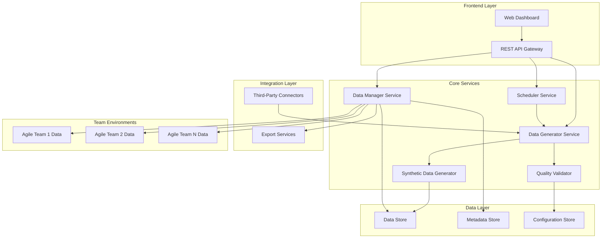

# Test Data Management Tool - Design Document

## Overview

The Test Data Management Tool is a comprehensive platform that automates the generation, management, and distribution of synthetic test data for multiple agile teams. Based on the TestMu Conference 2025 reference architecture, the system provides API-driven access, automated refresh cycles, and enterprise-grade data quality controls.

## Architecture

### High-Level Architecture



### Service Architecture Pattern

The system follows a microservices architecture with the following design principles:
- **Service Isolation**: Each core service operates independently
- **API-First Design**: All services expose REST APIs
- **Event-Driven Communication**: Services communicate via events for loose coupling
- **Data Isolation**: Team data environments are completely isolated
- **Horizontal Scalability**: Services can be scaled independently based on load

## Components and Interfaces

### 1. Data Generator Service

**Purpose**: Core engine for generating test data based on schemas and patterns

**Key Interfaces**:
```typescript
interface DataGeneratorService {
  generateData(schema: DataSchema, options: GenerationOptions): Promise<Dataset>
  validateSchema(schema: DataSchema): ValidationResult
  getGenerationStatus(jobId: string): GenerationStatus
  cancelGeneration(jobId: string): Promise<void>
}

interface DataSchema {
  entities: EntityDefinition[]
  relationships: RelationshipDefinition[]
  constraints: ConstraintDefinition[]
  volume: VolumeSpecification
}

interface GenerationOptions {
  format: 'JSON' | 'XML' | 'CSV' | 'SQL'
  teamId: string
  refreshCycle: boolean
  qualityLevel: 'basic' | 'standard' | 'premium'
}
```

**Responsibilities**:
- Parse data schemas and generation requests
- Coordinate with Synthetic Data Generator for data creation
- Manage generation jobs and status tracking
- Handle batch and real-time generation requests

### 2. Synthetic Data Generator

**Purpose**: Creates realistic synthetic data while preserving privacy and statistical properties

**Key Interfaces**:
```typescript
interface SyntheticDataGenerator {
  generateSyntheticData(template: DataTemplate, rules: PrivacyRules): Promise<SyntheticDataset>
  analyzePatternsFromSample(sampleData: Dataset): DataPatterns
  maskSensitiveData(data: Dataset, maskingRules: MaskingRules): Dataset
  validateSyntheticQuality(original: Dataset, synthetic: Dataset): QualityMetrics
}

interface PrivacyRules {
  piiFields: string[]
  maskingStrategy: 'anonymize' | 'pseudonymize' | 'generalize'
  preserveRelationships: boolean
  statisticalAccuracy: number
}
```

**Responsibilities**:
- Generate synthetic data that maintains statistical properties
- Apply privacy-preserving transformations
- Ensure referential integrity across related entities
- Validate synthetic data quality against original patterns

### 3. Data Manager Service

**Purpose**: Manages data lifecycle, team isolation, and data distribution

**Key Interfaces**:
```typescript
interface DataManagerService {
  createTeamEnvironment(teamId: string, config: TeamConfig): Promise<TeamEnvironment>
  distributeDataToTeam(teamId: string, dataset: Dataset): Promise<void>
  getTeamData(teamId: string, filters: DataFilters): Promise<Dataset>
  refreshTeamData(teamId: string): Promise<RefreshResult>
  archiveOldData(teamId: string, retentionPolicy: RetentionPolicy): Promise<void>
}

interface TeamEnvironment {
  teamId: string
  dataNamespace: string
  accessControls: AccessControl[]
  customizations: TeamCustomization[]
  refreshSchedule: RefreshSchedule
}
```

**Responsibilities**:
- Create and manage isolated team data environments
- Handle data distribution and access control
- Manage data versioning and archival
- Coordinate team-specific customizations

### 4. Quality Validator

**Purpose**: Ensures data quality and validates business rules

**Key Interfaces**:
```typescript
interface QualityValidator {
  validateDataQuality(dataset: Dataset, rules: QualityRules): Promise<QualityReport>
  defineQualityRules(schema: DataSchema): QualityRules
  generateQualityMetrics(dataset: Dataset): QualityMetrics
  suggestQualityImprovements(report: QualityReport): Improvement[]
}

interface QualityRules {
  completenessRules: CompletenessRule[]
  consistencyRules: ConsistencyRule[]
  businessRules: BusinessRule[]
  formatRules: FormatRule[]
}
```

**Responsibilities**:
- Define and enforce data quality standards
- Validate generated data against business rules
- Generate quality reports and metrics
- Provide quality improvement recommendations

### 5. Scheduler Service

**Purpose**: Manages automated refresh cycles and scheduled operations

**Key Interfaces**:
```typescript
interface SchedulerService {
  scheduleRefresh(teamId: string, schedule: RefreshSchedule): Promise<void>
  executeRefresh(refreshJob: RefreshJob): Promise<RefreshResult>
  getRefreshHistory(teamId: string): Promise<RefreshHistory[]>
  updateRefreshSchedule(teamId: string, newSchedule: RefreshSchedule): Promise<void>
}

interface RefreshSchedule {
  frequency: 'weekly' | 'biweekly' | 'monthly'
  dayOfWeek?: number
  timeOfDay: string
  timezone: string
  notificationSettings: NotificationSettings
}
```

**Responsibilities**:
- Schedule and execute automated data refresh cycles
- Manage refresh job queues and execution
- Handle refresh notifications and alerts
- Maintain refresh history and audit trails

## Data Models

### Core Data Entities

```typescript
// Dataset representation
interface Dataset {
  id: string
  name: string
  version: string
  teamId: string
  schema: DataSchema
  data: Record<string, any>[]
  metadata: DatasetMetadata
  createdAt: Date
  updatedAt: Date
}

// Team configuration
interface TeamConfig {
  teamId: string
  teamName: string
  dataRequirements: DataRequirement[]
  customizations: Customization[]
  accessLevel: 'read' | 'write' | 'admin'
  refreshPreferences: RefreshPreferences
}

// Generation job tracking
interface GenerationJob {
  jobId: string
  teamId: string
  schema: DataSchema
  status: 'pending' | 'running' | 'completed' | 'failed'
  progress: number
  startTime: Date
  endTime?: Date
  errorMessage?: string
}

// Quality metrics
interface QualityMetrics {
  completeness: number
  consistency: number
  accuracy: number
  validity: number
  uniqueness: number
  businessRuleCompliance: number
}
```

### Database Schema Design

```sql
-- Teams table
CREATE TABLE teams (
    team_id VARCHAR(50) PRIMARY KEY,
    team_name VARCHAR(100) NOT NULL,
    created_at TIMESTAMP DEFAULT CURRENT_TIMESTAMP,
    updated_at TIMESTAMP DEFAULT CURRENT_TIMESTAMP,
    config JSON
);

-- Datasets table
CREATE TABLE datasets (
    dataset_id VARCHAR(50) PRIMARY KEY,
    team_id VARCHAR(50) REFERENCES teams(team_id),
    name VARCHAR(100) NOT NULL,
    version VARCHAR(20) NOT NULL,
    schema_definition JSON NOT NULL,
    metadata JSON,
    created_at TIMESTAMP DEFAULT CURRENT_TIMESTAMP,
    updated_at TIMESTAMP DEFAULT CURRENT_TIMESTAMP
);

-- Generation jobs table
CREATE TABLE generation_jobs (
    job_id VARCHAR(50) PRIMARY KEY,
    team_id VARCHAR(50) REFERENCES teams(team_id),
    dataset_id VARCHAR(50) REFERENCES datasets(dataset_id),
    status VARCHAR(20) NOT NULL,
    progress INTEGER DEFAULT 0,
    start_time TIMESTAMP DEFAULT CURRENT_TIMESTAMP,
    end_time TIMESTAMP,
    error_message TEXT
);

-- Quality reports table
CREATE TABLE quality_reports (
    report_id VARCHAR(50) PRIMARY KEY,
    dataset_id VARCHAR(50) REFERENCES datasets(dataset_id),
    quality_metrics JSON NOT NULL,
    validation_results JSON,
    created_at TIMESTAMP DEFAULT CURRENT_TIMESTAMP
);
```

## Error Handling

### Error Categories and Responses

1. **Schema Validation Errors**
   - Invalid schema format
   - Missing required fields
   - Circular dependencies in relationships

2. **Data Generation Errors**
   - Insufficient memory or resources
   - Constraint conflicts
   - External dependency failures

3. **Quality Validation Errors**
   - Business rule violations
   - Data integrity issues
   - Format validation failures

4. **Team Management Errors**
   - Access control violations
   - Team configuration conflicts
   - Data isolation breaches

### Error Handling Strategy

```typescript
interface ErrorResponse {
  errorCode: string
  message: string
  details?: any
  timestamp: Date
  requestId: string
  suggestedActions?: string[]
}

// Global error handler
class ErrorHandler {
  static handleError(error: Error, context: RequestContext): ErrorResponse {
    // Log error with context
    // Determine error category
    // Generate appropriate response
    // Suggest remediation actions
  }
}
```

## Testing Strategy

### Unit Testing
- **Service Layer**: Test each service independently with mocked dependencies
- **Data Generation**: Validate synthetic data quality and privacy compliance
- **API Endpoints**: Test all REST endpoints with various input scenarios
- **Quality Validation**: Test business rule enforcement and quality metrics

### Integration Testing
- **Service Communication**: Test inter-service communication and event handling
- **Database Operations**: Test data persistence and retrieval operations
- **Third-Party Integrations**: Test external system connections and data exchange
- **Team Isolation**: Verify data isolation between team environments

### End-to-End Testing
- **Complete Workflows**: Test full data generation and distribution workflows
- **Refresh Cycles**: Test automated refresh processes and notifications
- **Multi-Team Scenarios**: Test concurrent team operations and data access
- **Performance Testing**: Test system performance under various load conditions

### Test Data Strategy
- **Synthetic Test Data**: Use the system itself to generate test data for testing
- **Schema Variations**: Test with various schema complexities and data volumes
- **Edge Cases**: Test boundary conditions and error scenarios
- **Security Testing**: Test access controls and data privacy measures

## Security Considerations

### Data Privacy
- All PII is anonymized or pseudonymized in synthetic data
- Data masking rules are enforced at generation time
- Audit trails track all data access and modifications
- Compliance with GDPR, CCPA, and other privacy regulations

### Access Control
- Role-based access control (RBAC) for team environments
- API authentication using JWT tokens or API keys
- Team data isolation enforced at database and application levels
- Administrative controls for system configuration and monitoring

### Data Security
- Encryption at rest for all stored data
- Encryption in transit for all API communications
- Secure key management for encryption keys
- Regular security audits and vulnerability assessments