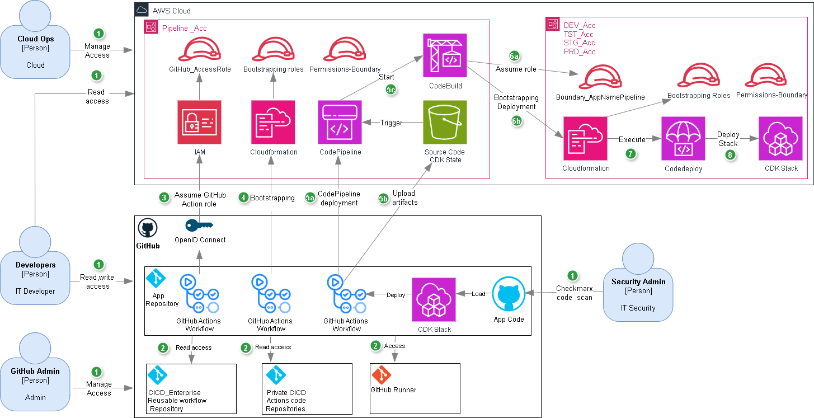

# CI/CD Applications 

## Table of Contents
- [CI/CD Pipeline End-to-End Execution Flow](#cicd-pipeline-end-to-end-execution-flow)
- [Overview](#overview)
- [Prerequisites](#prerequisites)
- [Template Configuration](#template-configuration)
  - [Workflow Trigger](#workflow-trigger)
  - [Required Parameters](#required-parameters)
  - [Required Permissions](#required-permissions)
  - [Branch Strategy](#branch-strategy)
  - [Template Example](#template-example)
- [Stack Creation Standards](#stack-creation-standards)
  - [Required Environment Variables](#required-environment-variables)
- [Stack Creation Templates](#stack-creation-templates)
  - [Implementation Guidelines](#implementation-guidelines)
  - [Language-Specific Stack Instantiation](#language-specific-stack-instantiation)
    - [TypeScript/JavaScript](#typescriptjavascript)
    - [Python](#python)
    - [.NET](#net)
- [Code Scanning](#code-scanning)
  - [Overview](#overview-1)
  - [Checkmarx Integration](#checkmarx-integration)
  - [Workflow Requirements](#workflow-requirements)
  - [Supported Scanning](#supported-scanning)
- [Troubleshooting](#troubleshooting)
- [Multi-Stack Deployment](#multi-stack-deployment)
  - [Workflow Dependencies](#workflow-dependencies)
  - [Key Configuration Elements](#key-configuration-elements)
  - [Deployment Sequence](#deployment-sequence)
- [Action Configuration (action.yml)](#action-configuration-actionyml)
  - [What is a Composite Action?](#what-is-a-composite-action)
  - [Benefits](#benefits)
  - [Required Parameters](#required-parameters-1)
- [PipelineStack code (cdk-code.ts)](#pipelinestack-code-cdk-codets)
- [CDK Application Entry Point](#cdk-application-entry-point)
  - [Environment Variable Management](#environment-variable-management)
  - [Role Naming Convention](#role-naming-convention)
  - [Stack Synthesizer Configuration](#stack-synthesizer-configuration)
  - [Pipeline Stack Instantiation](#pipeline-stack-instantiation)
  - [Configuration Properties](#configuration-properties)
    - [Environment Configuration](#environment-configuration)
    - [Cross-Account Properties](#cross-account-properties)
    - [Application Properties](#application-properties)
  - [Git Tag Creation Command](#git-tag-creation-command)

## CI/CD Pipeline End-to-End Execution Flow



The CI/CD pipeline follows a comprehensive end-to-end execution flow that ensures secure, automated deployment across multiple AWS environments:

1. **Initial Setup & Access Provisioning**
   - GitHub Admins and Cloud Ops provision and grant appropriate access to GitHub and AWS resources to enable secure collaboration for Developers.

2. **Repository & Workflow Configuration**
   - GitHub Repositories and workflows are configured to support application builds and deployments using reusable actions and runners.

3. **Secure Authentication**
   - GitHub Action uses OpenID Connect to securely assume GitHub_AccessRole for executing CI/CD operations.

4. **Pipeline Account Bootstrap**
   - GitHub Action bootstraps Pipeline account by provisioning required roles and permissions for CDK deployment.

5. **CI/CD Process Initiation**
   - GitHub Actions triggers CodePipeline to start CI/CD deployment process, build artifacts and CDK code are uploaded to S3 to be used by CodePipeline during the deployment process.

6. **Application Build & Package**
   - CodeBuild is invoked by CodePipeline to build and package the application for deployment.

7. **Cross-Account Deployment**
   - CodeBuild assumes a cross-account role to bootstrap and deploy to the target environment.

8. **Application Deployment Management**
   - CloudFormation executes CodeDeploy to manage the deployment of the application.

9. **Infrastructure Provisioning**
   - CDK Stack is deployed, provisioning the infrastructure and completing the CI/CD pipeline delivery.

## Overview
This section outlines the GitHub Actions workflow for deploying infrastructure across multiple AWS accounts using CDK.

## Prerequisites
- Understanding of GitHub workflows actions and CDK.
- AWS accounts set up for development, testing, staging, and production.
- Appropriate IAM roles and permissions boundaries configured.
- Checkmarx repo scan setup.
- Access to GitHub repository and GitHub actions.
- Self-hosted GitHub runner.


### Required Access Provisioning
**A ticket must be submitted to Cloud Ops,  GitHub Admin and IT Security  with the corresponding following information:**

#### Cloud Ops 
**Pipeline Account:**
  ```yaml
  - GitHub_AccessRole - OIDC role for GitHub Actions authentication
  - Permissions-Boundary - IAM permissions boundary for central account deployment
  ```

**Application Accounts (Dev/Test/Stage/Prod):**
  ```yaml
  - Boundary_CICDPipeline - Cross-account deployment boundary
  - Permissions-Boundary - IAM permissions boundary for target environments
  ```
#### GitHub Admin Requirements
  Request application private repo creation.
   
  ```yaml
  Access must be granted to the following private GitHub actions:
  - https://github.com/GlobeLifeAppDev/actions-setup-dotnet-v4
  - https://github.com/GlobeLifeAppDev/actions-checkout-v4
  - https://github.com/GlobeLifeAppDev/actions-upload-artifact-v4
  - https://github.com/GlobeLifeAppDev/actions-setup-node-v4.0.3
  - https://github.com/GlobeLifeAppDev/aws-actions-configure-aws-credentials-v4
  ```
#### IT Security 
```yaml
  List GitHub repos for scanning setup.
```
#### Who to contact
- **Scott Walls** - AWS accounts and role creation
- **Andy Hanif** - GitHub repository access and GitHub actions
- **Clint E. McWilliams** - Checkmarx scanning access

**Documentation Links:**
- CICD documentation: https://github.com/GlobeLifeAppDev/Pipeline
- GitHub request: https://devops.globelifeinc.com/projects/wikiHow/_wiki/wikis/wikiHow.wiki/1106/GitHub
- Workflows and actions: https://docs.github.com/en/actions/reference/workflows-and-actions
  

## Template Configuration

### Workflow Trigger
The workflow can be triggered by:
- Pull request into `main` branch
- Manual trigger using GitHub Actions interface (workflow_dispatch)

### Required Parameters
To use this template, configure the following parameters in your deploy.yml:

```yaml
dev-account: '<your-dev-account-id>'         # Development AWS account, optional, comment if not used
tst-account: '<your-test-account-id>'        # Test AWS account, optional, comment if not used
stg-account: '<your-staging-account-id>'     # Staging AWS account, optional, comment if not used
prd-account: '<your-prod-account-id>'        # Production AWS account, optional, comment if not used
app-name: '<your-app-name>'                  # Max 10 alphanumeric characters, grouping of related stacks 
stack-id: '<your-stack-id>'                  # Max 10 alphanumeric characters
app-dir: '${{ github.workspace }}/ApplicationStackCode'  # CDK application directory containing cdk.json
permissions-boundary: '<your-boundary-name>' # IAM permissions boundary, for central account
role-to-assume: 'arn:aws:iam::<account-id>:role/GitHub_AccessRole' # OIDC IAM role ARN, account-id of central account
platform: 'typescript'                       # Supported: .net, python, typescript
cross-account-boundary: 'Boundary_<appspecific)' # boundary policy for bootstrapping in target accounts, supplied by AWS WebOps
approval-notification: '<email>'             # request for approval email/dist list
action-type: 'deploy/destroy'                # will deploy CDK or destroy CDK, CDK must be updated, a comment can be used
```

### Required Permissions
The workflow requires the following GitHub permissions:

```yaml
permissions:
  deployments: write
  statuses: write
  contents: write
  id-token: write
  actions: write
  checks: write
  packages: write
  pull-requests: write
```

### Branch Strategy
1. **Branch Setup**
   - Deployment should be execute using main branch.
   - Update the workflow trigger in deploy.yml to match your branch name:
   ```yaml
   on:
     push:
       branches:
         - main    # it must be main 
     workflow_dispatch:

### Template Example
A complete workflow template is available at [.github/workflows/template.yml](.github/workflows/template.yml) in this repository. Here's the template structure:

```yaml
name: Deploy Infrastructure
on:
  push:
    branches:
      - main
  workflow_dispatch:
permissions:
  deployments: write
  statuses: write
  contents: write
  id-token: write
  actions: write
  checks: write
  packages: write
  pull-requests: write
jobs:
  deploy:
    runs-on: 
      - self-hosted
    steps:
      - name: Checkout Pipeline Code
        id: checkout
        uses: GlobeLifeAppDev/actions-checkout-v4@main
        continue-on-error: false
      - name: Deploy CDK Infrastructure
        id: deploy-step
        if: success()   
        uses: GlobeLifeAppDev/Pipeline@v1.0.1
        with: 
          dev-account: '<dev-account-id>'
          tst-account: '<test-account-id>'
          stg-account: '<staging-account-id>'
          prd-account: '<prod-account-id>'
          app-name: '<app-name>'
          stack-id: '<stack-id>'
          app-dir: '${{ github.workspace }}/ApplicationStackCode'
          permissions-boundary: '<boundary-name>'
          role-to-assume: 'arn:aws:iam::<account-id>:role/<role-name>'
          platform: 'typescript'
          cross-account-boundary: '<cross-account-boundary>'
          approval-notification: '<email>'
          action-type: 'deploy'
        continue-on-error: false
```

## Stack Creation Standards

### Overview
This section outlines the standardized approach for creating new CDK stacks using DefaultStackSynthesizer with APP_NAME as a qualifier, applicable across supported CDK languages (.NET, Python, TypeScript).

### Required Environment Variables
The following environment variables must be setup:
- `APP_NAME`: Application identifier (max 10 alphanumeric characters).
- `CDK_DEFAULT_ACCOUNT`: AWS account ID
- `CDK_DEFAULT_REGION`: AWS region

## Stack Creation Templates

### Implementation Guidelines
1. Stack Naming Conventions
  - Stack names must follow the pattern: 'AppStack' + APP_NAME + STACK_ID
  - APP_NAME must be converted to lowercase when used as qualifier

2. DefaultStackSynthesizer Configuration
  - Required properties for all languages:
  - qualifier: lowercase APP_NAME value

3. Stack Properties
  - Required stack properties across all languages:
  - synthesizer/Synthesizer: DefaultStackSynthesizer instance
  - env/Environment: Account and Region configuration

### Language-Specific Stack Instantiation

### TypeScript/JavaScript
```typescript
import * as cdk from 'aws-cdk-lib';
import { ApplicationStack } from '../lib/cdk-code-stack';

const appTst = new cdk.App();

function getRequiredEnvVar(name: string): string {
  const value = process.env[name];
  if (!value) {
      throw new Error(`Required environment variable ${name} is not set`);
  }
  return value;
}
const app_name = getRequiredEnvVar('APP_NAME');
const stack_id = getRequiredEnvVar('STACK_ID');
const qualifier = app_name.toLowerCase();

const appDefaultSynthesizerApp = new cdk.DefaultStackSynthesizer({
  bucketPrefix: cdk.DefaultStackSynthesizer.DEFAULT_FILE_ASSET_PREFIX,
  qualifier: qualifier
});


new ApplicationStack(appTst, 'AppStack' + app_name + stack_id,{ // 'AppStack' + app_name + stack_id
  synthesizer: appDefaultSynthesizerApp,
  env: {
    account: process.env.CDK_DEFAULT_ACCOUNT,
    region: process.env.CDK_DEFAULT_REGION,
  },
  
});

appTst.synth();
```

## Code Scanning

### Overview
The CI/CD pipeline integrates mandatory security code scanning using Checkmarx to ensure code quality and security compliance before production deployments. All pull requests to the main branch undergo automated security scanning with attestation verification in AWS CodePipeline.

### Checkmarx Integration
- **Pull Request Scanning**: Checkmarx automatically scans all pull requests to the main branch.
- **Attestation Required**: Code attestation confirms security scanning passed before proceeding.
- **Audit Trails**: Complete compliance reporting and audit logs for all scanning activities.

### Workflow Requirements
1. **Pull Request Process**:
   - All code changes must be submitted via pull request to main branch
   - Checkmarx scan automatically triggers on pull request creation
   - Pull request cannot be merged until security scan passes

2. **CodePipeline Attestation**:
   - Pipeline verifies Checkmarx scan completion before deployment stages
   - Failed or incomplete scans block deployment progression
   - Attestation records maintained for compliance requirements

3. **Security Policies**:
   - Configurable security thresholds and approval workflows
   - Automated blocking of deployments with security vulnerabilities
   - Emergency bypass procedures available with proper audit trails

### Legacy System Support
- **Baseline Vulnerability Assessment**: Checkmarx CxSAST performs initial comprehensive scan to establish security baseline for legacy codebases
- **Incremental Scanning**: CxFlow integration enables differential analysis, scanning only modified code sections against established baseline
- **Vulnerability Threshold Management**: CxSAST policy engine configured to block new vulnerabilities while maintaining existing baseline
- **Legacy Code Exemptions**: Pre-existing vulnerabilities marked as accepted risks with proper documentation and approval workflows

### Supported Scanning
- **SAST**: Static Application Security Testing
- **SCA**: Software Composition Analysis for third-party dependencies
- **Vulnerability Detection**: Comprehensive security vulnerability identification
- **Multi-Language Support**: Compatible with .NET, Python, TypeScript, and other platforms

#### Python
```Python

import os
from aws_cdk import App, DefaultStackSynthesizer

app = App()
app_name = os.environ.get('APP_NAME', '').lower()
stack_id = os.environ.get('STACK_ID', '').lower()
if not app_name:
    raise ValueError('APP_NAME environment variable is required')

stack_synthesizer = DefaultStackSynthesizer(
    qualifier=app_name
)

YourStack(app, f"AppStack{app_name}{stack_id}",
    synthesizer=stack_synthesizer,
    env={
        'account': os.environ.get('CDK_DEFAULT_ACCOUNT'),
        'region': os.environ.get('CDK_DEFAULT_REGION')
    }
)
```

#### .NET
```C#

  using Amazon.CDK;
   
  var app = new App();
  var appName = Environment.GetEnvironmentVariable("APP_NAME")?.ToLowerInvariant();
  if (string.IsNullOrEmpty(appName))
      throw new Exception("APP_NAME environment variable is required");

  var stackId = Environment.GetEnvironmentVariable("STACK_ID")?.ToLowerInvariant();
  if (string.IsNullOrEmpty(stackId))
      throw new Exception("STACK_ID environment variable is required");

  var stackSynthesizer = new DefaultStackSynthesizer(new DefaultStackSynthesizerProps
  {
      Qualifier = appName
  });

  new YourStack(app, $"AppStack{appName}{stackId}", new StackProps
  {
      Synthesizer = stackSynthesizer,
      Env = new Environment
      {
          Account = System.Environment.GetEnvironmentVariable("CDK_DEFAULT_ACCOUNT"),
          Region = System.Environment.GetEnvironmentVariable("CDK_DEFAULT_REGION")
      }
  });

```
## Troubleshooting
Common issues to watch for:
- Incorrect AWS account IDs
- Missing or invalid permissions
- CDK synthesis failures
- Runner connectivity issues
- Invalid application directory structure

# Multi-Stack Deployment

## Overview
The CI/CD pipeline supports multi-stack deployments where stacks have dependencies on each other. This is achieved using GitHub's `workflow_run` trigger to create sequential deployment workflows.

## Workflow Dependencies
Use the `workflow_run` trigger to create dependent workflows that execute after a prerequisite workflow completes successfully:

```yaml
on:
  workflow_run:
    workflows: ["Deploy API Infrastructure"]
    types: 
      - completed 
    branches: [main_branch]
```

## Key Configuration Elements

### Workflow Run Trigger
- **workflows**: Array of workflow names that must complete before this workflow runs
- **types**: Trigger condition (typically `completed`)
- **branches**: Specific branches to monitor for workflow completion

### Example: Dependent Stack Deployment
```yaml
name: Deploy UI Infrastructure

on:
  workflow_run:
    workflows: ["Deploy API Infrastructure"]
    types: 
      - completed 
    branches: [main_branch] 
  push:
    branches:
      - main_branch
  workflow_dispatch:

jobs:
  deploy:
    runs-on: 
      - self-hosted
    steps:
      - name: Deploy CDK Infrastructure
        uses: GlobeLifeAppDev/Pipeline@v1.0.1
        with: 
            app-name: 'AppSRE'
            stack-id: 'UIStack'
            app-dir: '${{ github.workspace }}/ApplicationStackCodeUI'
```

## Deployment Sequence
1. Primary workflow (e.g., API Infrastructure) completes
2. Dependent workflow (e.g., UI Infrastructure) automatically triggers
3. Each stack maintains its own configuration and deployment parameters
4. Sequential execution ensures proper dependency resolution

## Action Configuration (action.yml)

### Overview
The action.yml file defines the configuration and metadata for the GitHub Action, specifying inputs, outputs, and runtime environment.

### What is a Composite Action?
A composite action is a collection of multiple GitHub Actions steps that can be reused across different workflows. Think of it as creating a reusable function for your CI/CD processes.

### Benefits
 - Reusability : Package common deployment steps that can be used across multiple workflows
 - Maintainability : Update shared functionality in one central location
 - Encapsulation : Hide complex deployment logic behind a simple interface
 - Standardization : Ensure consistent deployment processes across projects

### Required Parameters
 - name: The name of your GitHub Action
 - description: A clear description of the action's purpose
 - inputs: Definition of input parameters
 - outputs: Definition of output values
 - runs: Execution configuration

## PipelineStack code (cdk-code.ts)

### Overview
The PipelineStack folder contains the CDK infrastructure code for defining and deploying CI/CD pipelines across different environments.

## CDK Application Entry Point

### Overview
This file serves as the entry point for the AWS CDK application, configuring the pipeline stack and its associated resources. It handles environment variable management, cross-account deployments, and stack synthesis.

#### Environment Variable Management

```typescript
function getRequiredEnvVar(name: string): string {
  const value = process.env[name];
  if (!value) {
      throw new Error(`Required environment variable ${name} is not set`);
  }
  return value;
}
```
#### Required environment variables:
 - DEV_ACCOUNT: Dev environment account ID
 - TST_ACCOUNT: Test environment account ID
 - STG_ACCOUNT: Staging environment account ID
 - PRD_ACCOUNT: Production environment account ID
 - APP_NAME: Application name
 - STACK_ID: Stack identifier 
 - APP_DIR: Application directory
 - PLATFORM: Platform identifier
 - PERMISSIONS_BOUNDARY: OIDC IAM permissions boundary

#### Role Naming Convention

 ```typescript
 const ROLE_NAME_PREFIX = 'PipelineStack' + app_name + stack_id;
 const roleNamingConventionAspect = new RoleNamingConventionAspect(ROLE_NAME_PREFIX);
 cdk.Aspects.of(app).add(roleNamingConventionAspect);
```

 - Enforces consistent IAM role naming across the stack
 - Applies naming convention aspect to all resources
 - Prefixes roles with 'PipelineStack' and the application name
 
#### Stack Synthesizer Configuration
 ```typescript
const appDefaultSynthesizer = new cdk.DefaultStackSynthesizer({
  bucketPrefix: cdk.DefaultStackSynthesizer.DEFAULT_FILE_ASSET_PREFIX,
  qualifier: qualifier,
});
```

 - Configures asset handling and deployment.
 - Uses default file asset prefix.
 - Applies application-specific qualifier.

 #### Pipeline Stack Instantiation
 ```typescript
 new PipelineStack(app, 'PipelineStack'+ app_name + stack_id, {
   env: {
     account: process.env.CDK_DEFAULT_ACCOUNT,
     region: process.env.CDK_DEFAULT_REGION
   },
   tstcrossAccountId: tst_cross_account,
   stgcrossAccountId: stg_cross_account,
   prdcrossAccountId: prd_cross_account,
   appname: app_name,
   stackid: stack_id,
   appdirectory: app_dir,
   platform: platform,
   permissionsboundary: permissions_boundary,
   synthesizer: appDefaultSynthesizer,
 });
 ```
  ## Configuration Properties
  
  ### Environment Configuration
  | Property | Type | Description | Required |
  |----------|------|-------------|-----------|
  | `env.account` | `string` | AWS account ID for pipeline deployment | Yes |
  | `env.region` | `string` | AWS region for pipeline deployment | Yes |
  
  ### Cross-Account Properties
  | Property | Type | Description | Required |
  |----------|------|-------------|-----------|
  | `tstcrossAccountId` | `string` | AWS account ID for test environment | Yes |
  | `stgcrossAccountId` | `string` | AWS account ID for staging environment | Yes |
  | `prdcrossAccountId` | `string` | AWS account ID for production environment | Yes |
  
  ### Application Properties
  | Property | Type | Description | Required |
  |----------|------|-------------|-----------|
  | `appname` | `string` | Application identifier used for resource naming | Yes |
  | `appdirectory` | `string` | Directory path containing application source code | Yes |
  | `platform` | `string` | Target platform identifier for deployment | Yes |
  | `permissionsboundary` | `string` | IAM permissions boundary name | Yes |
  | `synthesizer` | `DefaultStackSynthesizer` | Stack synthesizer configuration for assets | Yes |
  
  ### Git Tag Creation Command
    git tag -a v1.0.0 -m "Release v1.0.0 - CDK Pipeline v1.0.0"
    git push origin v1.0.0Git Tag Creation Command